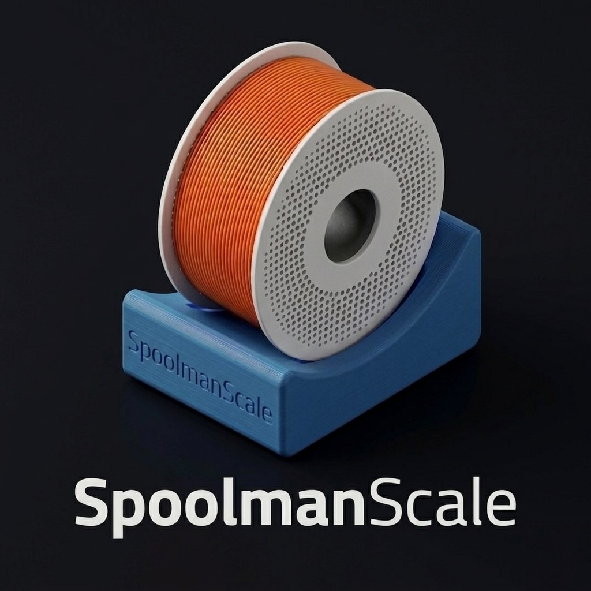

  

# SpoolmanScale

> ⚠️ **Work in Progress** – Hardware complete, Public Beta firmware ready. Public Beta release coming soon - **late April 2026**.

**SpoolmanScale** is an open-source ESP32-based filament scale with NFC reader, integrating directly with [Spoolman](https://github.com/Donkie/Spoolman).

Place a spool on the scale – it reads the NFC tag, pulls the spool data from Spoolman, and lets you update the remaining weight, log a drying date, or archive empty spools. All from a 3.5" touchscreen. No phone needed.

> A running [Spoolman](https://github.com/Donkie/Spoolman) instance on your local network is required – this is what stores all your spool data.

---

## Status

Public beta is planned for **late April 2026** – still waiting for a suitable USB-C panel mount extension. The firmware has seen massive progress over the past days – DE/EN language support, a completely redesigned main screen, guided first-boot setup, and automatic Spoolman extra field configuration are all done. The public beta is close.
---

  
  

---

## Features

- 🏷️ **Bambu Lab NFC tags** – automatic read & KDF decryption, material/color/vendor shown instantly
- 🔗 **Spool linking** – place any unlinked NFC tag on the scale and SpoolmanScale will guide you through linking it to a spool in your Spoolman library. Browse the filtered spool list right on the touchscreen, tap to confirm, and the tag is linked instantly – material, vendor and color are pulled automatically from Spoolman. You can also enter the Spoolman ID directly.
  - **Bambu Lab tags** – the spool list is filtered by unlinked spools and matching material type, so you always see the most relevant options first
  - **Third-party NTAG stickers** – filtered by unlinked spools, with vendor selection available on-screen to help narrow things down
- ⚖️ **Live weight (NAU7802)** – moving average filter, TARE, live diff vs. Spoolman remaining weight
- 📡 **Spoolman REST API** – update remaining weight, set initial weight, set spool weight (per spool / filament / vendor), log drying date, archive spools
- 📱 **Redesigned touchscreen UI (LVGL 8.3, 480×320)** – new 5-zone main screen layout with detailed filament info, color swatch, live weight zones, and a "More Info" filament screen
- 🌐 **DE/EN language support** – full interface in German and English, switchable at any time in settings
  - The language system is built to be extensible – additional languages can be contributed by the community
- 🚀 **Guided first-boot setup** – on first power-on, SpoolmanScale walks you through language selection, Wi-Fi, Spoolman IP, and scale calibration step by step
- 🔧 **Automatic Spoolman extra field setup** – SpoolmanScale checks if the required extra fields exist in Spoolman and adds them automatically if not
- ⚙️ **On-device Wi-Fi setup** – scan networks, enter credentials and Spoolman IP directly on the touchscreen
- 🔄 **OTA firmware updates** – upload new firmware via browser, no IDE needed
- ⚡ **Web Flasher** – first-time flash via browser over USB, no IDE needed ([niko11111.github.io/SpoolmanScale](https://niko11111.github.io/SpoolmanScale))
- 🌙 **Power management** – display dimming, deep sleep, wake via touch

---

## Hardware

| Component | Model | Link |
|---|---|---|
| MCU + Display | WT32-SC01 Plus (ESP32-S3, 480×320, ST7796) | [AliExpress](https://a.aliexpress.com/_Ey1VKfI) |
| Debug Board (recommended) | ZXACC-ESPDB | [AliExpress](https://a.aliexpress.com/_Eu5Y0Ug) |
| NFC Reader | PN532 | [AliExpress](https://a.aliexpress.com/_ExScN8M) |
| Scale ADC | NAU7802 (Adafruit) | [AliExpress](https://a.aliexpress.com/_EvlFNj2) |
| Load Cell | YZC-133 2 kg beam cell (5 kg works as well) | [AliExpress](https://a.aliexpress.com/_EuhhVF2) |
| Connector Cables | STEMMA QT / JST cables | [AliExpress](https://a.aliexpress.com/_Ezjg6fQ) |
| Connector Cables (recommended) | Micro JST 1.0 SH 5-pin – for easier assembly and maintenance | [Amazon](https://amzn.eu/d/0aKJ4Va9) |
| USB-C Panel Mount 90° Extension | 90°, 30 cm | *still testing – some panel mount extensions lack USB-C PD or data support; more options coming soon* |

**Additional materials:**
- Thin stranded wire in 5 different colors (black, red, yellow, white,~30–40 cm each)
- 2× M5×25 socket head screws, 2× M4×15 socket head screws
- 9× M2.5×5 self-tapping screws, 2–4× M2×4.4 self-tapping screws ([something like this](https://a.aliexpress.com/_EyCD3rS))
    - Self-tapping screws are recommended, but standard machine screws (M2.5×5, M2×4) will likely work as well if you have them on hand.

## 3D Files

The printable enclosure files will be available soon on MakerWorld:
👉 [makerworld.com/@FormFollowsF](https://makerworld.com/@FormFollowsF)

---

## Before Public Beta (remaining work)

- [ ] **USB-C panel mount extension** – currently testing options; many cables lack full USB-C PD and data support, waiting for the right one
- [ ] **Enclosure revision** – final adjustments to the case once the USB-C extension is confirmed
- [ ] **Assembly & wiring guide** – documentation for hardware assembly, wiring, first flash and basic usage
- [ ] **Final firmware testing** – last round of testing before release
- [ ] **GitHub Release** – publish `.bin` files and tag the first public release

## Timeline

Public beta is planned for **late April 2026** – still waiting for a suitable USB-C panel mount extension and making some final firmware improvements.

---

## 🙋 Early Adopters & Feedback

If you're one of the first to build and test SpoolmanScale, I'd love to hear your feedback! I only have one non-Bambu spool myself, and all my Bambu spools were already linked in Spoolman – so I'm especially curious how well the spool linking flow works with a larger number of unlinked spools, both Bambu Lab and third-party via NFC tag stickers. If you have many unlinked spools, your feedback would be incredibly valuable.

👉 Join the [Discord](https://discord.gg/sWrSQ4Pxj) and share your experience!

---

## Known Issues

These are known limitations in the current beta – nothing critical, but worth being aware of:

- **Occasional reboots when navigating between screens** – related to the LVGL overlay architecture and the ESP32 watchdog timer. Happens rarely and the device recovers on its own.
- **Crash when wrong Spoolman IP is entered** – the HTTP client blocks the UI loop long enough for the watchdog to trigger. Workaround: make sure the correct IP is entered before proceeding past the setup screen. A proper fix is planned for a post-release update.

---

## Roadmap

**V0.x (planned after release)**
- GitHub OTA auto-check
- FW and UI tweaks
- User feedback might bring up things I did not think about

---

## Spoolman Setup

SpoolmanScale uses Spoolman's **extra fields** to store NFC tag UIDs and drying dates.
The required extra fields are created automatically on first connection – no manual setup needed.

| Field | Type | Used for |
|---|---|---|
| `tag` | Text | NFC tag UID (Bambu UUID or NTAG UID) |
| `last_dried` | DateTime | Last drying date |

**Recommended add-on: [OpenSpoolMan](https://github.com/drndos/openspoolman)**
OpenSpoolMan connects to your Bambu printer via MQTT and reads which filament is loaded in which AMS tray. It uses the same `extra.tag` field to identify spools – so if your Bambu spools are already linked in SpoolmanScale, OpenSpoolMan will recognize them instantly without any additional setup. Both tools run alongside each other and complement each other well.

---

## Inspiration

- [PandaBalance 2](https://makerworld.com) by the Makerworld community
- [SpoolEase](https://github.com/yanshay/SpoolEase) by yanshay

---

💬 **Community & Support:** [Join Discord](https://discord.gg/sWrSQ4Pxj)

*Not affiliated with Spoolman. Uses the Spoolman REST API.*

*Full wiring diagrams, BOM, and build guide will be published with the first public beta.*

💛 **If you find this project useful: You can buy me a coffee** [ko-fi.com/formfollowsfunction](https://ko-fi.com/formfollowsfunction)
