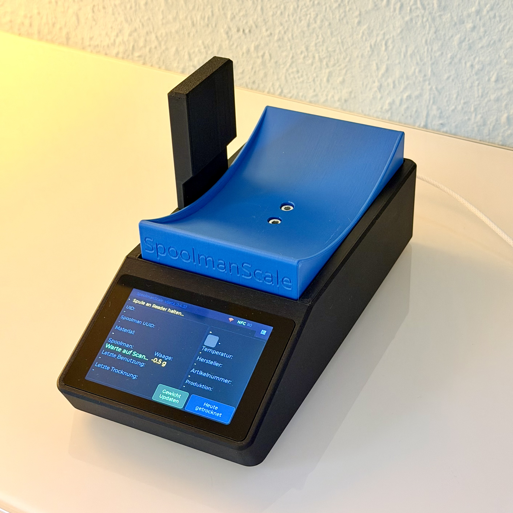
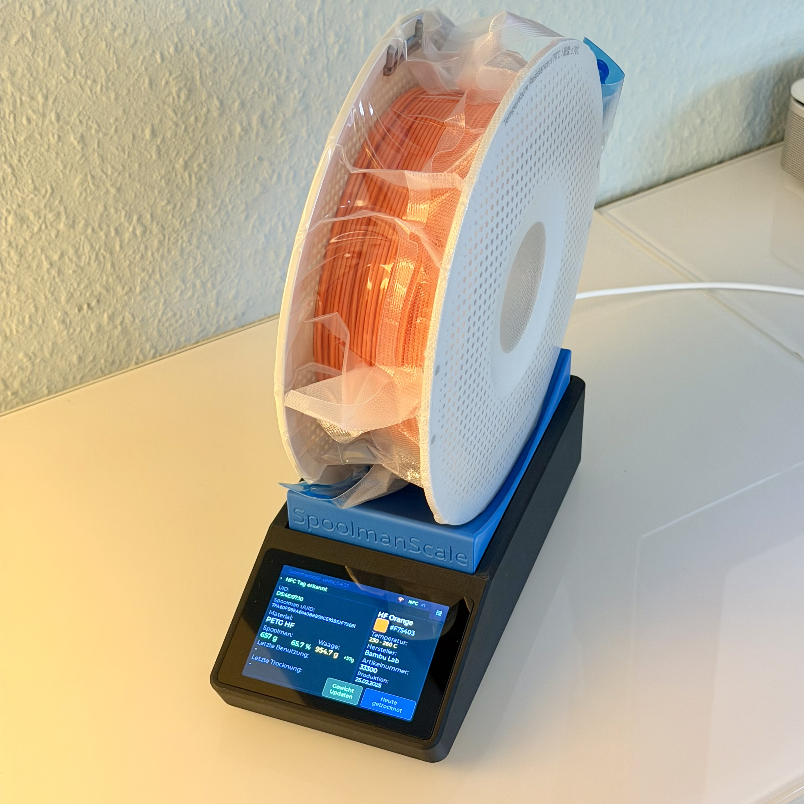

# SpoolmanScale

> ⚠️ **Work in Progress** – Hardware complete, firmware in Beta. Public release coming soon.

**SpoolmanScale** is an open-source ESP32-based filament scale with NFC reader, integrating directly with [Spoolman](https://github.com/Donkie/Spoolman).

Place a spool on the scale – it reads the NFC tag, pulls the spool data from Spoolman, and lets you update the remaining weight, log a drying date, or archive empty spools. All from a 3.5" touchscreen. No phone needed.

> A running [Spoolman](https://github.com/Donkie/Spoolman) instance on your local network is required – this is what stores all your spool data.

---

## Status

The hardware is complete: enclosure printed, all components installed, fully assembled and working.
The firmware is stable at **Beta_0.4.38**. A few backend features are missing before I'll publish a public beta (see roadmap below).

---

  
  

---

## Features so far
- 🏷️ **Bambu Lab NFC tags** – automatic read & KDF decryption, material/color/vendor shown instantly
- 🔗 **Third-party spool linking** – place any NTAG (NFC) sticker → select spool from on-screen list → linked in Spoolman via `extra.tag`
- ⚖️ **Live weight (NAU7802)** – moving average filter, TARE, live diff vs. Spoolman remaining weight
- 📡 **Spoolman REST API** – update remaining weight, set initial weight, set spool weight (per spool / filament / vendor), log drying date, archive spools
- 📱 **Touchscreen UI (LVGL 8.3, 480×320)** – settings menu, confirmation popups, sleep/wake, no-tag timer
- ⚙️ **On-device settings** – Spoolman IP:Port, scale calibration, bag weight (stored in NVS)
- 🌙 **Power management** – display dimming, deep sleep, wake via touch

---

## Hardware

| Component | Model | Link |
|---|---|---|
| MCU + Display | WT32-SC01 Plus (ESP32-S3, 480×320, ST7796) | [AliExpress](https://a.aliexpress.com/_Ey1VKfI) |
| Debug Board (recommended) | ZXACC-ESPDB | [AliExpress](https://a.aliexpress.com/_Eu5Y0Ug) |
| NFC Reader | PN532 | [AliExpress](https://a.aliexpress.com/_ExScN8M) |
| Scale ADC | NAU7802 (Adafruit) | [AliExpress](https://a.aliexpress.com/_EvlFNj2) |
| Load Cell | YZC-133 2 kg beam cell (5 kg works as well) | [AliExpress](https://a.aliexpress.com/_EuhhVF2) |
| Connector Cables | STEMMA QT / JST cables | [AliExpress](https://a.aliexpress.com/_Ezjg6fQ) |
| Connector Cables (recommended) | Micro JST 1.0 SH 5-pin – for easier assembly and maintenance | [Amazon](https://amzn.eu/d/0aKJ4Va9) |
| USB-C Extension | 90°, 30 cm | [AliExpress](https://a.aliexpress.com/_EJXbJk8) |

**Additional materials:**
- Thin stranded wire in 5 different colors (black, red, yellow, white,~30–40 cm each)
- 2× M5×25 socket head screws, 2× M4×15 socket head screws
- 9× M2.5×5 self-tapping screws, 2–4× M2×4.4 self-tapping screws ([something like this](https://a.aliexpress.com/_EyCD3rS))
    - Self-tapping screws are recommended, but standard machine screws (M2.5×5, M2×4) will likely work as well if you have them on hand.

## 3D Files

The printable enclosure files will be available soon on MakerWorld:
👉 [makerworld.com/@FormFollowsF](https://makerworld.com/@FormFollowsF)

---

## Before Public Beta (remaining work)

- [ ] **Wi-Fi setup via UI** – scan networks, enter credentials and Spoolman IP on-device (currently hardcoded)
- [ ] **OTA firmware updates** – browser-based upload + partition table restructure
- [ ] **Web Flasher** – first-time flash via browser, no IDE needed (USB → GitHub Pages → done)
- [ ] **Info/firmware screen** – version number, update button, instructions
- [ ] **DE/EN language support**

## Timeline

Public beta is planned for **mid-April 2026** – right now I'm on family vacation 😄

---

## Roadmap

**V1.x (planned after release)**
- Non-Bambu spools linked via standard NFC tag are already working – even deeper integration is planned
- UI overhaul – layout, typography, icons
- GitHub OTA auto-check

---

## Inspiration

- [PandaBalance 2](https://makerworld.com) by the Makerworld community
- [SpoolEase](https://github.com/yanshay/SpoolEase) by yanshay

---

*Not affiliated with Spoolman. Uses the Spoolman REST API.*

*Full wiring diagrams, BOM, and build guide will be published with the first public beta.*

💛 **If you find this project useful: You can bye me a coffee** [ko-fi.com/formfollowsfunction](https://ko-fi.com/formfollowsfunction)
