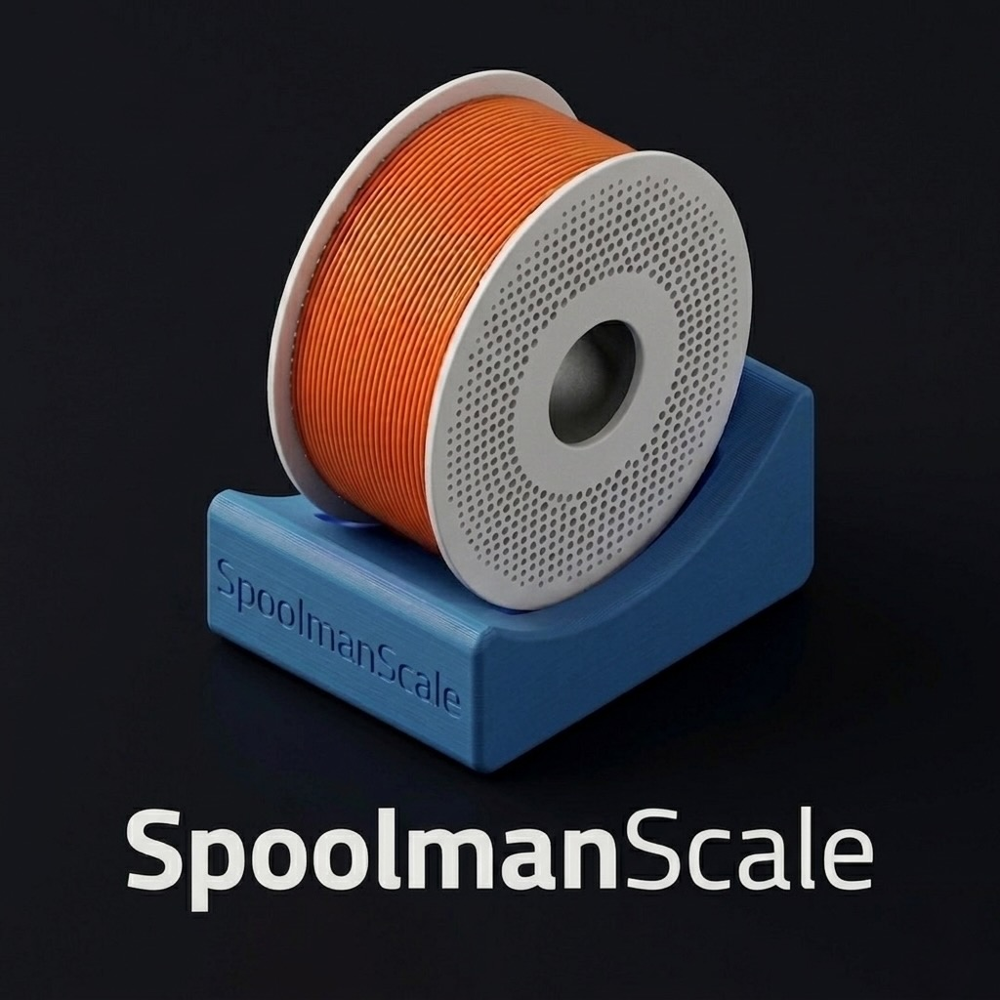
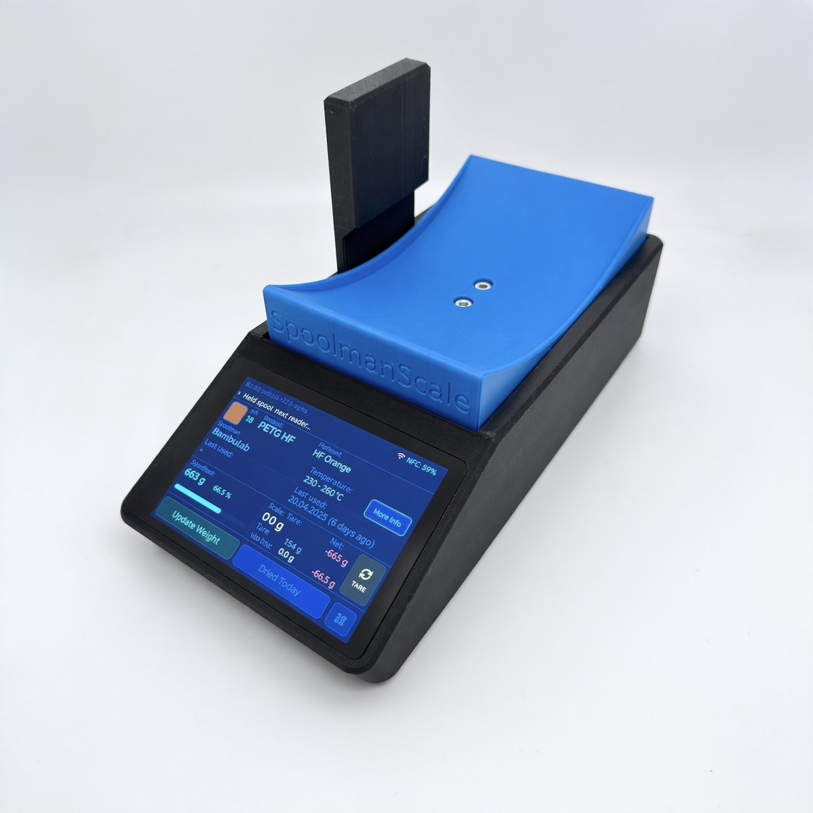
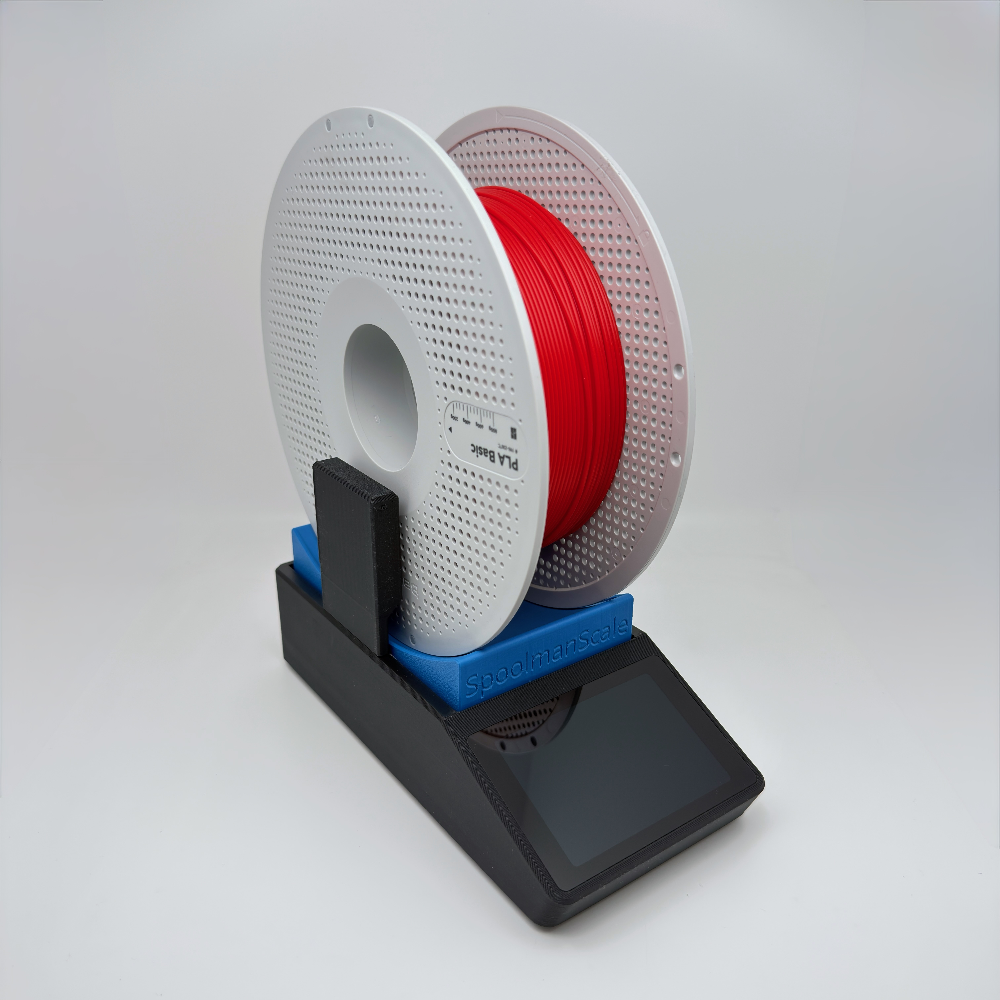

<picture>
  <source media="(prefers-color-scheme: light)" srcset="images/logo_1.jpeg">
  <source media="(prefers-color-scheme: dark)" srcset="images/logo_2.jpeg">
  
</picture>

# SpoolmanScale

### *One Scale to rule them all.*

> 🚀 **Public Beta** – This is beta software, provided as-is. Expect bugs, rough edges, and missing documentation. Use at your own risk.

**SpoolmanScale** is an open-source ESP32-based filament scale with NFC reader, integrating directly with [Spoolman](https://github.com/Donkie/Spoolman).

Yes, another filament scale – but hear me out, this one might actually earn a spot next to your printer. 😄

Place a spool on the scale – it reads the NFC tag, pulls the spool data from Spoolman, and lets you update the remaining weight, log a drying date, or archive empty spools. All from a 3.5" touchscreen. No phone needed.

> A running [Spoolman](https://github.com/Donkie/Spoolman) instance on your local network is required – this is what stores all your spool data.

---

## Status

🎉 **Public Beta is live!** Firmware is released and available via the [Web Flasher](https://niko11111.github.io/SpoolmanScale) or as a direct download from [Releases](https://github.com/Niko11111/SpoolmanScale/releases).

> **Please note:** This is a beta release. A more detailed guide is in the works, but this README already covers all the essential steps to get your SpoolmanScale up and running. If you run into issues, join the [Discord](https://discord.gg/GzQzGa5pBG) – happy to help.

Currently tested with a Spoolman library of 260+ active spools and running stable. If you have an even larger collection – I'd love to hear how it holds up!

---

 

  
  
 

---

## Features

- 🏷️ **Bambu Lab NFC tags** – place a spool on the scale and SpoolmanScale reads it instantly: material, color, vendor, remaining weight and drying history appear automatically. No tapping required
- 🔗 **Bambu Lab spool linking** – SpoolmanScale finds the matching Spoolman entry automatically by filtering by material type, subtype (e.g. HF, CF, Matte) and color similarity — so you only see spools that actually match your tag
- 🔗 **Third-party spool linking** – place any NTAG sticker → select vendor and material → pick from a filtered list → linked in Spoolman via `extra.tag`
- 📋 **Copy spool** – running low? Place a new spool on the scale, tap Copy Spool, and SpoolmanScale creates an identical entry in Spoolman, tags the NFC chip, and logs the current weight — all in one step
- ⚖️ **Live weight (NAU7802)** – moving average filter, TARE, live diff vs. Spoolman remaining weight
- 📡 **Spoolman REST API** – update remaining weight, set initial weight, set spool weight (per spool / filament / vendor), log drying date, archive spools
- 📱 **Touchscreen UI (LVGL 8.3, 480×320)** – settings menu, confirmation popups, sleep/wake
- ⚙️ **On-device Wi-Fi setup** – scan networks, enter credentials and Spoolman IP directly on the touchscreen
- 🔄 **Firmware updates (OTA)** – check for updates and flash new firmware directly on the device – just tap the update button. No PC, no cables, nothing. Or upload a firmware file from any browser – PC or smartphone
- ⚡ **Web Flasher** – first-time flash via browser over USB. All you need is a browser and a USB cable – no software installation required: [niko11111.github.io/SpoolmanScale](https://niko11111.github.io/SpoolmanScale)
- 🌍 **DE / EN language support** – language selection on first boot, switchable in settings. Full umlaut support (ä, ö, ü) since v0.5.6
- 🌙 **Power management** – display dimming, deep sleep, wake via touch
- 🪵 **SD card logging** – insert a microSD card and SpoolmanScale logs all events automatically. Download logs via browser – no disassembly needed

---

## Hardware

| Component | Model | Link |
|---|---|---|
| MCU + Display | WT32-SC01 Plus (ESP32-S3, 480×320, ST7796) | [AliExpress](https://de.aliexpress.com/item/1005006050379552.html) |
| Debug Board (not necessary) | ZXACC-ESPDB | [AliExpress](https://a.aliexpress.com/_Eu5Y0Ug) |
| NFC Reader | PN532 | [AliExpress](https://a.aliexpress.com/_ExScN8M) |
| Scale ADC | NAU7802 (Adafruit recommended) | [AliExpress](https://de.aliexpress.com/item/1005011685825986.html) |
| Load Cell | YZC-133 **2 kg** beam cell (5 kg works too) | [AliExpress](https://a.aliexpress.com/_EuhhVF2) |
| USB-C Panel Mount 90° | 30 cm, Left/Right Angled, full USB-C PD + data | [AliExpress](https://de.aliexpress.com/item/1005003488021890.html) |
| Connector Cables | STEMMA QT / JST cables | [AliExpress](https://de.aliexpress.com/item/1005011904682215.html) |
| Connector Cables (easier assembly) | Micro JST 1.0 SH 5-pin | [Amazon](https://amzn.eu/d/0aKJ4Va9) |

The 3D printable enclosure is available on MakerWorld:
👉 [makerworld.com/@FormFollowsF](https://makerworld.com/de/models/2713675-spoolmanscale#profileId-3005075)

📖 A detailed build guide, wiring diagrams, and setup instructions are available in the **[SpoolmanScale Documentation](https://niko11111.github.io/SpoolmanScale-Docs/)** *(work in progress)*

---
## Getting Started

**1. Order parts & print the enclosure**
Order from the hardware list and print the enclosure while you wait for shipping.

**2. Flash the board first**
Before assembling, flash via the [Web Flasher](https://niko11111.github.io/SpoolmanScale). Verify it works before wiring.

**3. Wire & assemble**
Full wiring tables and assembly tips: **[SpoolmanScale Documentation](https://niko11111.github.io/SpoolmanScale-Docs/)** *(work in progress)*

**4. Calibrate**
Settings → Scale → Calibration. Done.

---

## Spoolman Setup

SpoolmanScale uses Spoolman's **extra fields** to store NFC tag UIDs and drying dates. The following fields are required and created automatically during first-time setup:

| Field | Type | Used for |
|---|---|---|
| `tag` | Text | NFC tag UID (Bambu UUID or NTAG UID) |
| `last_dried` | DateTime | Last drying date |

**Recommended add-on: [OpenSpoolMan](https://github.com/drndos/openspoolman)**
OpenSpoolMan connects to your Bambu printer via MQTT and reads which filament is loaded in which AMS tray. It uses the same `extra.tag` field – so if your spools are already linked in SpoolmanScale, OpenSpoolMan will recognize them instantly.

---

## Roadmap

### Coming soon

- 📍 **Location support** *(Phase 1 live in v0.5.8-beta)* – assign and view storage locations directly on the scale via the More Info screen. Picks from all locations in Spoolman, supports clearing the location. Note: due to a Spoolman API limitation, only locations with at least one spool assigned are shown. Auto-popup after tag removal coming in a future update
- 🌡️ **Drying reminder** – color-coded `last_dried` date showing whether a spool needs drying. Thresholds configurable per material group or manually in the settings menu

### In progress

- 🔌 **FilaMan support** – SpoolmanScale will get a FilaMan mode that creates compatible tokens and integrates natively with [FilaMan](https://github.com/Fire-Devils/filaman-system). Early-stage, active development

### Also in the works

- 🖥️ **SpoolmanScale Pro** – not yet a Spoolman or FilaMan user? No Raspberry Pi at home, and the words "terminal", "SSH", "Docker" and "YAML" make you want to close the tab? That's exactly what SpoolmanScale Pro is for. A Pi Zero 2W inside the same enclosure – or any other Pi outside – running Spoolman or FilaMan locally, set up almost entirely through a web UI. Only a few commands to get the Pi up and running – that's it. Sneak peek: [github.com/Niko11111/SpoolmanScalePro-Pi](https://github.com/Niko11111/SpoolmanScalePro-Pi)

- 📦 **SpoolmanScale Pro – pre-assembled** – want all of that, but don't know how to solder and just want something that works straight out of the box? I'm considering a small production run of fully assembled, ready-to-use SpoolmanScale Pro units – no soldering, no setup headaches, just plug it in. Nothing is decided yet, a lot still needs to be figured out, and it all depends on interest. **Would a finished, assembled unit be worth it to you? Let me know in the [Discord](https://discord.gg/GzQzGa5pBG) or drop a comment on [MakerWorld](https://makerworld.com/de/models/2713675-spoolmanscale#profileId-3005075)!**

### Community requests & ideas

- Fix: occasional crashes during first-time setup and settings navigation
- Fix: crash on invalid Spoolman IP
- More ideas welcome – open an issue or join the [Discord](https://discord.gg/GzQzGa5pBG)!

---

## Known Issues

**Occasional reboots / UI freezes during menu navigation**
In some cases, navigating between settings screens can cause the UI to freeze or the device to reboot. If the UI freezes, unplug to force a reboot – no data is lost. This is a known issue with the LVGL overlay architecture and is on the list to fix.

---

## Support This Project

A lot of my free time – time I could have spent with my family – has gone into building SpoolmanScale. If you enjoy using it, please help spread the word:

- ⭐ **Star this repo on GitHub** – it helps more people discover the project
- ⭐⭐⭐⭐⭐ **Rate 5 stars & boost on MakerWorld** – every like, rating and boost helps: [makerworld.com/@FormFollowsF](https://makerworld.com/de/models/2713675-spoolmanscale#profileId-3005075)
- ☕ **Support on Ko-fi** – even a single euro makes a difference: [ko-fi.com/formfollowsfunction](https://ko-fi.com/formfollowsfunction)
- 💬 **Join the Discord** – share your build, report issues, or just say hi: [discord.gg/GzQzGa5pBG](https://discord.gg/GzQzGa5pBG)

Have a feature request? Post it in the [Discord](https://discord.gg/GzQzGa5pBG) or [open an issue](https://github.com/Niko11111/SpoolmanScale/issues) – I read every one of them and do my best to make it happen.

**Thank you for your support. It means a lot. 🙏**

---

## Inspiration

- [PandaBalance 2](https://makerworld.com) by the MakerWorld community
- [SpoolEase](https://github.com/yanshay/SpoolEase) by yanshay

---

*Not affiliated with Spoolman. Uses the Spoolman REST API.*

## Verdrahtungsplan

# Verdrahtung SpoolmanScale (main.cpp)

Board: **WT32-SC01 Plus (ESP32-S3)** — Display, Touch, SD-Karte sind bereits onboard verdrahtet (fest verlötet). Extern angeschlossen sind nur **PN532** und **NAU7802**.

## 1. Display (ST7796, Parallel8-Bus, onboard)

| Signal | GPIO | Funktion |
|--------|------|----------|
| WR   | 47 | Write-Strobe |
| RD   | -1 | nicht verwendet |
| RS   | 0  | Register-Select (D/C) |
| D0   | 9  | Datenbus Bit 0 |
| D1   | 46 | Datenbus Bit 1 |
| D2   | 3  | Datenbus Bit 2 |
| D3   | 8  | Datenbus Bit 3 |
| D4   | 18 | Datenbus Bit 4 |
| D5   | 17 | Datenbus Bit 5 |
| D6   | 16 | Datenbus Bit 6 |
| D7   | 15 | Datenbus Bit 7 |
| CS   | -1 | nicht verwendet |
| RST  | 4  | Display-Reset |
| BUSY | -1 | nicht verwendet |
| BL   | 45 | Backlight (PWM, Kanal 7, 44,1 kHz) |

Panel: 320×480, invert=true, rgb_order=false

## 2. Touch-Controller (FT5x06/FT6336U, I2C Bus 0, onboard)

| Signal | GPIO | Funktion |
|--------|------|----------|
| SDA | 6 | Touch-I2C Data |
| SCL | 5 | Touch-I2C Clock |
| INT | 7 | Interrupt / Wake-Up |

I2C-Adresse: 0x38, 400 kHz. Wird direkt von LovyanGFX verwaltet (`LGFX::_touch`-Konfiguration, `cfg.i2c_port=0`), kein eigenes `TwoWire`-Objekt dafür.

## 3. SD-Karte (SPI/HSPI, onboard)

| Signal | GPIO | Funktion |
|--------|------|----------|
| CS   | 41 | Chip-Select |
| SCK  | 39 | Clock (CLK) |
| MOSI | 40 | CMD |
| MISO | 38 | D0 |

Eigener SPI-Bus (`spiSD`, HSPI) — kein Konflikt mit dem Display-Parallel-Bus.

## 4. PN532 (NFC-Reader, extern, I2C-Modus)

| PN532-Pin | Ziel | Funktion |
|-----------|------|----------|
| VCC (Pin 1) | +5V | Versorgung |
| GND (Pin 2) | GND | Masse |
| SDA (Pin 3) | GPIO 10 | I2C Data (Bus `I2C_EXT`) |
| SCL (Pin 4) | GPIO 11 | I2C Clock (Bus `I2C_EXT`) |
| RST (Pin 5) | GPIO 12 | Reset |

**DIP-Schalter PN532:** SW1=ON, SW2=OFF → I2C-Modus

IRQ-Pin ist **nicht verdrahtet** (`Adafruit_PN532 nfc(-1, 12, &I2C_EXT)` → IRQ=-1)

## 5. NAU7802 (Wägezellen-ADC, extern, I2C)

| Signal | GPIO | Funktion |
|--------|------|----------|
| SDA | 10 | I2C Data (Bus `I2C_EXT`, gemeinsam mit PN532) |
| SCL | 11 | I2C Clock (Bus `I2C_EXT`, gemeinsam mit PN532) |

I2C-Adresse: 0x2A. NAU7802 und PN532 teilen sich denselben externen I2C-Bus (`I2C_EXT`, `TwoWire(1)`), GPIO10/11.

## Übersicht I2C-Busse

| Bus-Objekt | SDA | SCL | Geräte |
|------------|-----|-----|--------|
| Touch (LovyanGFX-intern, Bus 0) | GPIO 6 | GPIO 5 | Touch-Controller (onboard) |
| `I2C_EXT` (Bus 1) | GPIO 10 | GPIO 11 | PN532 (0x24), NAU7802 (0x2A) — extern |

## Extended-IO-Stecker (offizielle Wireless-Tag-Pinbelegung)

Quelle: WT32-SC01-Plus-Datasheet (Wireless-Tag/Smart Panlee), Tabelle "Extended IO Interface" — am Board mit "扩展IO接口 / Extended IO Interface" beschriftet.

| Pin | Bezeichnung | GPIO | Aderfarbe (dieses Kabel) | Verwendung |
|-----|-------------|------|--------------------------|------------|
| 1 | +5V | – | – | Stromversorgung PN532 + NAU7802 |
| 2 | GND | – | – | Masse PN532 + NAU7802 |
| 3 | EXT_IO1 | GPIO 10 | gelb | I2C SDA (`I2C_EXT`) |
| 4 | EXT_IO2 | GPIO 11 | grün | I2C SCL (`I2C_EXT`) |
| 5 | EXT_IO3 | GPIO 12 | blau | PN532 RST |
| 6 | EXT_IO4 | GPIO 13 | weiß | nicht genutzt |
| 7 | EXT_IO5 | GPIO 14 | braun | nicht genutzt |
| 8 | EXT_IO6 | GPIO 21 | – | nicht genutzt |

**Hinweis:** Die einzige tatsächliche externe Verkabelung im Aufbau betrifft den PN532 (5 Adern: VCC, GND, SDA, SCL, RST auf GPIO10/11/12). Die NAU7802-Wägezelle hängt am selben `I2C_EXT`-Bus (GPIO10/11), eine feste Ladezellen-Verkabelung (E+/E-/A+/A-) ist im Code nicht ersichtlich (steckt im NAU7802-Breakout selbst).

