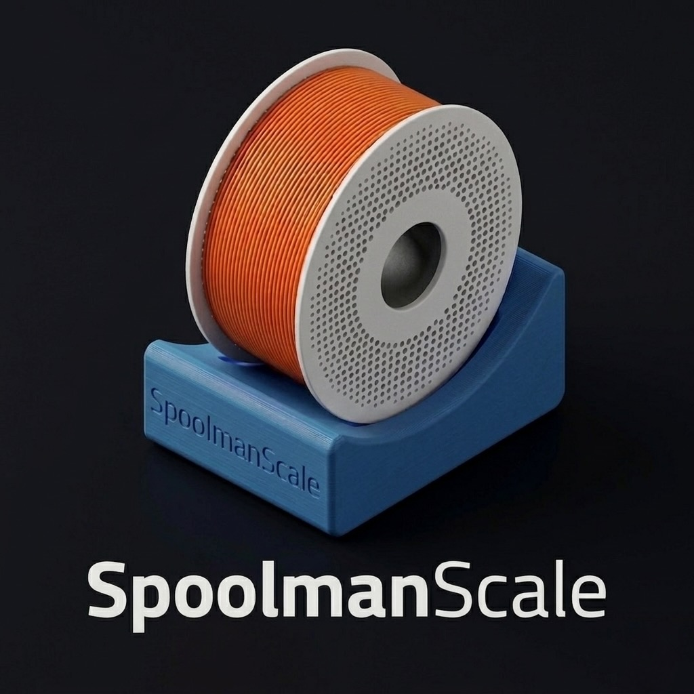
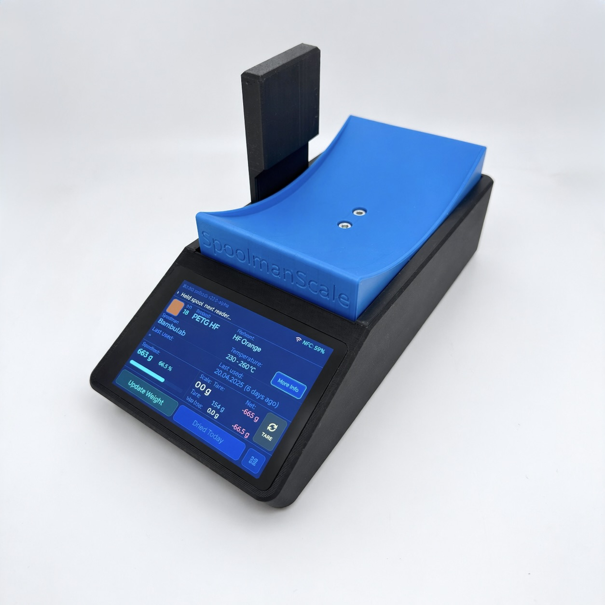
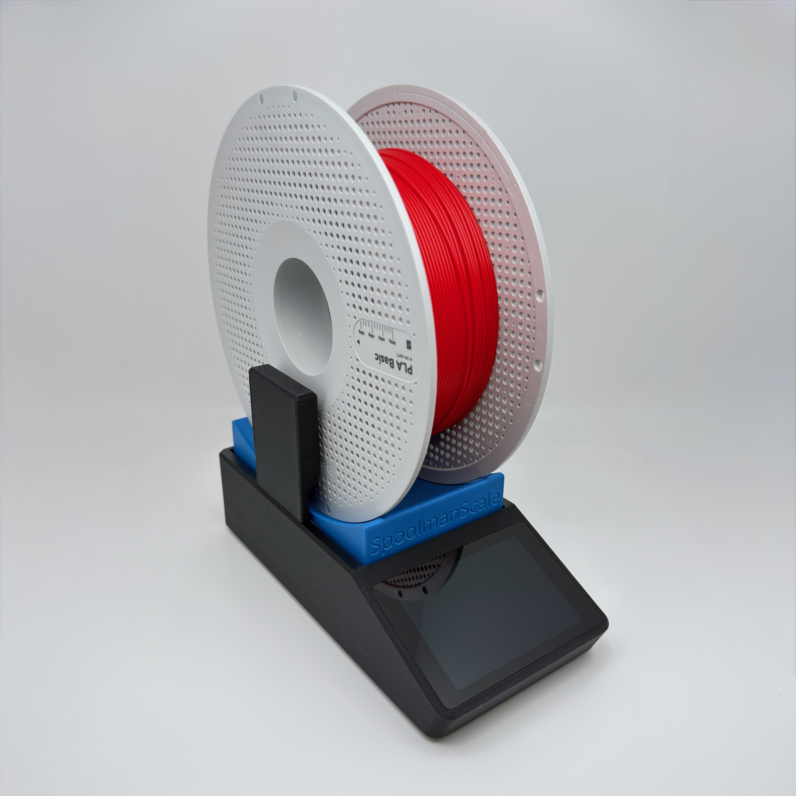

<picture>
  <source media="(prefers-color-scheme: light)" srcset="images/logo_1.jpeg">
  <source media="(prefers-color-scheme: dark)" srcset="images/logo_2.jpeg">
  
</picture>

# SpoolmanScale

### *One Scale to rule them all.*

> [!IMPORTANT]
> **SpoolmanScale is a front end, not a database.** It needs one of three filament managers running on your network - [Spoolman](https://github.com/Donkie/Spoolman), [FilaMan](https://github.com/Fire-Devils/filaman-system) or [BamBuddy](https://github.com/maziggy/BamBuddy). That is where your spools live; the scale reads them, weighs them and writes the result back.
>
> No server yet? Any always-on machine will do, a Raspberry Pi included. [SpoolmanScale Pro](https://github.com/Niko11111/SpoolmanScalePro-Pi) sets one up for you almost entirely through a web UI.

**SpoolmanScale** is an open-source ESP32-based filament scale with an NFC reader. It works with [Spoolman](https://github.com/Donkie/Spoolman), [FilaMan](https://github.com/Fire-Devils/filaman-system) and [BamBuddy](https://github.com/maziggy/BamBuddy), and you can switch between them at any time.

Yes, another filament scale – but hear me out, this one might actually earn a spot next to your printer. 😄

Place a spool on the scale – it reads the NFC tag, pulls the spool data from your filament manager, and lets you update the remaining weight, log a drying date, set a location or archive empty spools. All from a 3.5" touchscreen. No phone needed.

And it writes tags, too. Link a spool to a blank NTAG and the scale puts the spool data on it, so the tag is readable by your printer and by every other tool that speaks OpenSpool.

---

## New in 0.8.0

- 🏷️ **Label printing (beta, first version)** – via Bluetooth on a Phomemo M220 (M110 experimental), with material, colour, spool ID and a QR code to the spool. This is a start: labels straight from the backend, a small editor in the browser, more printers and sizes are planned
- ⚡ **Much faster** – linking a new spool takes under a second instead of 2 to 7 s, the inventory loads in the background while the screen keeps working, and touch is read 100 times a second
- 🧵 **Spoolman 0.27 native tags** – tags belong to the spool, several per spool, and existing scales move over by themselves
- 🔧 **New foundation** – Arduino core 3.3, twice the room for firmware, 72 KB more free memory
- 🇫🇷 **French**, contributed by nanostra

Everything else is in the [release notes](https://github.com/Niko11111/SpoolmanScale/releases/tag/v0.8.0).

> [!NOTE]
> **Already running 0.7.x?** Because 0.8.0 divides the memory anew, this one update goes through the [Web Flasher](https://niko11111.github.io/SpoolmanScale) once: connect, choose **Update**, about 2 minutes, all settings are kept. From then on updates arrive over the air as before.

---

## Download

Firmware is available via the [Web Flasher](https://niko11111.github.io/SpoolmanScale) or as a direct download from [Releases](https://github.com/Niko11111/SpoolmanScale/releases). Already have a scale? Update it right on the device: **Settings → System → Firmware Update → Update via GitHub**.

Over 200 people are running a SpoolmanScale, and it is tested daily against a Spoolman library of 260+ active spools. If you have an even larger collection, I'd love to hear how it holds up. Questions or trouble? Join the [Discord](https://discord.gg/xadskCrPFu), happy to help.

---

 

  
  
 

---

## Features

- 🏷️ **Bambu Lab NFC tags** – place a spool on the scale and SpoolmanScale reads it instantly: material, color, vendor, remaining weight and drying history appear automatically. No tapping required
- 🔗 **Bambu Lab spool linking** – SpoolmanScale finds the matching entry automatically by filtering by material type, subtype (e.g. HF, CF, Matte) and color similarity, so you only see spools that actually match your tag
- 🔗 **Third-party spool linking** – place any NTAG sticker or MIFARE Classic card → select vendor and material → pick from a filtered list → linked and done. Snapmaker tags can be read as well (an option in the web settings)
- ✍️ **Writing NFC tags** – the scale does not just read tags, it writes them, with every backend and without help from the server. Link a spool and the data goes on the tag right away, silently or after a prompt, whichever you prefer. Notices later on when tag and inventory drift apart and offers to put it right. Four formats: OpenSpool, FilaMan, Anycubic ACE, or erase. A spool can carry a tag on each side: right after linking, the scale asks for the second one. Tap the NFC chip in the header to see what is on the tag on the reader
- 📋 **Copy spool** – running low? Place a new spool on the scale, tap Copy Spool, and SpoolmanScale creates an identical entry, tags the NFC chip and logs the current weight, all in one step
- ⚖️ **Live weight (NAU7802)** – moving average filter, TARE, live diff against the remaining weight in your database
- 🔀 **Three backends** – [Spoolman](https://github.com/Donkie/Spoolman), [FilaMan](https://github.com/Fire-Devils/filaman-system) or [BamBuddy](https://github.com/maziggy/BamBuddy), switchable in the settings. Update remaining weight, set initial and spool weight (per spool / filament / vendor), log drying dates, set locations, archive and restore spools. BamBuddy can keep its own inventory or run against a Spoolman server behind it - the scale works out which and writes to the right one
- 🖨️ **AMS view** – with FilaMan and BamBuddy: every AMS unit with its bays, material, colour, remaining filament, humidity and temperature. Tap a bay and a card shows the spool behind it, and you can record a drying right there, without taking the spool out
- 📍 **Locations** – assign and view storage locations on the scale, with an optional popup when you take a spool off
- 🌡️ **Drying reminder** – color-coded `last_dried` date showing whether a spool needs drying, with thresholds per material or set manually
- 📱 **Touchscreen UI (LVGL 8.3, 480×320)** – settings menu, confirmation popups, sleep/wake
- ⚙️ **On-device setup** – language, Wi-Fi and server address step by step on the touchscreen. Wi-Fi can also come straight from the Web Flasher or from your phone, so there is no long password to type on a small screen
- 🌐 **Web interface** – rebuilt from the ground up as separate pages, in all three languages, as usable on a phone as on a desktop. Update the firmware straight from GitHub with the release notes in front of you, switch backends, write tags, read and follow the log. Areas you would rather not expose can be switched off individually
- 🩺 **Self-diagnosis** – when something is wrong, the scale says so in plain words instead of a four-character code: a chip that does not answer, an NFC reader that answers but does nothing, a missing calibration, a load cell wired the wrong way round, readings too unsteady to trust. Tap the message and it explains what to do, with a button that takes you there
- 🏷️ **Label printing (beta)** – print a label for a spool on a Bluetooth label printer (Phomemo M220 for now), with a QR code that opens the spool in your backend. A first version that will grow
- 🔄 **Firmware updates (OTA)** – check and flash directly on the device or from the browser. No PC, no cables. Or upload a firmware file yourself
- ⚡ **Web Flasher** – first-time flash via browser over USB. All you need is a browser and a USB cable: [niko11111.github.io/SpoolmanScale](https://niko11111.github.io/SpoolmanScale)
- 🌍 **DE / EN / FR language support** – chosen on first boot, switchable in settings, and it applies to the web interface as well
- 🌙 **Power management** – display dimming, deep sleep, and the display wakes on its own when you put something on the pad
- 🧾 **Works without a load cell, too** – switch off *Scale fitted* and the device becomes a pure tag terminal: read, link and write tags and set locations, without weights on the screen
- 🪵 **Logging, with or without SD card** – the scale logs what it does, to a microSD card or to its internal memory. Read it in the browser, live if you want, no disassembly needed
- ⏰ **Small things that add up** – timestamps in your own time zone, and the scale answers to `spoolmanscale.local` so there is no IP address to remember

---

## Hardware

| Component | Model | Link |
|---|---|---|
| MCU + Display | WT32-SC01 Plus (ESP32-S3, 480×320, ST7796) | [AliExpress](https://de.aliexpress.com/item/1005006050379552.html) |
| Debug Board (not necessary) | ZXACC-ESPDB | [AliExpress](https://a.aliexpress.com/_Eu5Y0Ug) |
| NFC Reader | PN532 | [AliExpress](https://a.aliexpress.com/_ExScN8M) |
| Scale ADC | NAU7802 (Adafruit recommended) | [AliExpress](https://de.aliexpress.com/item/1005011685825986.html) |
| Load Cell | YZC-133 **2 kg** beam cell (5 kg works too) | [AliExpress](https://a.aliexpress.com/_EuhhVF2) |
| USB-C Panel Mount 90° | 30 cm, Left/Right Angled, full USB-C PD + data | [AliExpress](https://de.aliexpress.com/item/1005003488021890.html) |
| Connector Cables | STEMMA QT / JST cables | [AliExpress](https://de.aliexpress.com/item/1005011904682215.html) |
| Connector Cables (easier assembly) | Micro JST 1.0 SH 5-pin | [Amazon](https://amzn.eu/d/0aKJ4Va9) |

Prefer everything in one cart? A community member put together an AliExpress list with parts that work well too: 👉 [SpoolmanScale parts list on AliExpress](https://www.aliexpress.com/p/wish-manage/share.html?spm=a2g0o.cart.headerAcount.6.321738dayZTIa0&wishGroupId=800000022363334&smbPageCode=wishlist-amp&spreadId=E95BDFF0E1B4367408F1423D8C0ABF206981C084C10F93E3EE124B0AFA678D69)

The 3D printable enclosure is available on MakerWorld:
👉 [makerworld.com/@FormFollowsF](https://makerworld.com/de/models/2713675-spoolmanscale#profileId-3005075)

📖 A detailed build guide, wiring diagrams and setup instructions are available in the **[SpoolmanScale Documentation](https://niko11111.github.io/SpoolmanScale-Docs/)**

---
## Getting Started

**1. Order parts & print the enclosure**
Order from the hardware list and print the enclosure while you wait for shipping.

**2. Flash the board first**
Before assembling, flash via the [Web Flasher](https://niko11111.github.io/SpoolmanScale). Verify it works before wiring.

**3. Wire & assemble**
Full wiring tables and assembly tips: **[SpoolmanScale Documentation](https://niko11111.github.io/SpoolmanScale-Docs/)**

**4. Calibrate**
Settings → Scale → Calibration. Done.

---

## Server Setup

On first boot the scale asks which filament manager you use and then only shows the steps that apply.

###  Spoolman

**Spoolman 0.27 and newer:** tags are stored the native way. They belong to the spool instead of sitting in an extra field, a spool can carry several, and a scan at the scale can open that spool in your browser. New setups use this by default, and a scale that used `extra.tag` before moves over once by itself; the old fields stay filled.

**Older Spoolman versions** keep tags in **extra fields**, and the drying date lives in one on every version. The scale creates any field it is missing the first time it writes:

| Field | Type | Used for |
|---|---|---|
| `tag` | Text | NFC tag UID (Bambu UUID or NTAG UID) |
| `last_dried` | DateTime | Last drying date |

Which field holds the UID on an older Spoolman is your choice: `tag` is the default, `nfc_id` is what FilaMan and nfc2klipper use, and `card_uids` is SpoolLink's list format for the Snapmaker U1. Reading always covers all three, so switching never hides a spool.

**Recommended add-on: [OpenSpoolMan](https://github.com/drndos/openspoolman)**
OpenSpoolMan connects to your Bambu printer via MQTT and reads which filament is loaded in which AMS tray. It finds Bambu spools by the UUID in `extra.tag` and does not know Spoolman's native tags yet. With native tags, turn on **For OpenSpoolman** in the scale's Spoolman settings and the scale writes the UUID there as well, so OpenSpoolMan recognizes your linked spools instantly.

###  FilaMan

No extra fields needed. Tags are written to FilaMan's native `rfid_uid` field, and spools you imported from Spoolman are recognised by their old tag and migrated across on the first scan.

FilaMan needs an **API key** and a **device token**. Both are entered through the scale's built-in webserver, same page as the firmware update. The scale has a button that takes you straight there.

> An API key inherits the permissions of the user who created it. If you would rather not hand the scale an admin key, create a separate user with a limited role. The exact list of permissions SpoolmanScale needs is behind the ℹ️ button on that page.

FilaMan reaches furthest into the tag features. It can send the scale a write job together with the tag contents, which you confirm on the device, and it can ask the scale to read a tag and take the data into its inventory. Lift a freshly weighed spool off the pad and the scale offers to hand it to FilaMan for the next printer that loads a tray, so you do not have to assign it by hand.

With FilaMan 1.3.7 or newer, the FilaMan tab open in your browser jumps to the spool you put on the scale. Pick the scale as your reader once in FilaMan's browser settings.

Because both write to the same field, a spool you link to an NTAG here is recognised by **FilaMan's own smartphone app** as well - scan the sticker with your phone and the spool comes up.

**Recommended add-on: [Bambu Usage Tracker](https://github.com/Niko11111/FilaManBambuUsage)**
For anyone running Bambu spools: it counts filament as it is printed and books it against the right spool, so your inventory stays right without weighing after every job.

###  BamBuddy

BamBuddy needs an **API key**, entered on the same page as the FilaMan credentials.

It can keep its inventory in its own database or use a Spoolman server behind it. The scale detects which of the two it is talking to and says so in the status bar, because a few things differ: with Spoolman behind it, tare values and the drying date are stored the Spoolman way.

One thing only BamBuddy can do: create a spool straight from a Bambu tag. Material, brand, colour and temperatures come off the tag, and the new spool is linked to it in the same step.

---

## Roadmap

### In progress

- ➕ **New spools right from the scale** – create a new spool on the device, with every backend, from the information on the spool's own tag or from other sources, instead of copying an existing spool
- ⚖️ **Smarter linking** – when several spools look alike, the list puts the one whose remaining weight matches the scale first
- 🧩 **More of BamBuddy** – the groundwork is done and everything you can do with Spoolman you can do here. What else belongs on a scale is what we are working out now, and requests are welcome. Next up: Bambu spools hand BamBuddy their chip UIDs as well, so both sides of a spool are known
- 🏷️ **Label printing, the next steps** – the first version prints a label the scale renders itself. Next: labels straight from the backend (FilaMan first, where @akira69 is working on label printing), a small editor in the browser to choose what a label shows, the printer's status (paper, lid), and more printers and label sizes. I cannot buy every printer, so help from the community is very welcome
- 🧹 **First-time setup polish** – language and time zone have their own welcome screen; Wi-Fi and the server address still borrow the settings screens
- 🌍 **Filament managers on the internet** – not only servers on your own network, but also filament managers that run online. Early development

### Also in the works

- 🖥️ **SpoolmanScale Pro** – not yet a Spoolman or FilaMan user? No Raspberry Pi at home, and the words "terminal", "SSH", "Docker" and "YAML" make you want to close the tab? That's exactly what SpoolmanScale Pro is for. A Pi Zero 2W inside the same enclosure, or any other Pi outside, running Spoolman or FilaMan locally, set up almost entirely through a web UI. Only a few commands to get the Pi up and running, that's it. Sneak peek: [github.com/Niko11111/SpoolmanScalePro-Pi](https://github.com/Niko11111/SpoolmanScalePro-Pi)

- 📦 **SpoolmanScale Pro, pre-assembled** – want all of that, but don't know how to solder and just want something that works straight out of the box? I'm considering a small production run of fully assembled, ready-to-use SpoolmanScale Pro units. No soldering, no setup headaches, just plug it in. Nothing is decided yet, a lot still needs to be figured out, and it all depends on interest. **Would a finished, assembled unit be worth it to you? Let me know in the [Discord](https://discord.gg/xadskCrPFu) or drop a comment on [MakerWorld](https://makerworld.com/de/models/2713675-spoolmanscale#profileId-3005075)!**

### Community requests & ideas

- More ideas welcome – open an issue or join the [Discord](https://discord.gg/xadskCrPFu)!

---

## Support This Project

A lot of my free time – time I could have spent with my family – has gone into building SpoolmanScale. If you enjoy using it, please help spread the word:

- ⭐ **Star this repo on GitHub** – it helps more people discover the project
- ⭐⭐⭐⭐⭐ **Rate 5 stars & boost on MakerWorld** – every like, rating and boost helps: [makerworld.com/@FormFollowsF](https://makerworld.com/de/models/2713675-spoolmanscale#profileId-3005075)
- ☕ **Support on Ko-fi** – even a single euro makes a difference: [ko-fi.com/formfollowsfunction](https://ko-fi.com/formfollowsfunction)
- 💬 **Join the Discord** – share your build, report issues, or just say hi: [discord.gg/xadskCrPFu](https://discord.gg/xadskCrPFu)

Have a feature request? Post it in the [Discord](https://discord.gg/xadskCrPFu) or [open an issue](https://github.com/Niko11111/SpoolmanScale/issues) – I read every one of them and do my best to make it happen.

**Thank you for your support. It means a lot. 🙏**

---

## Credits

**[@Simon-CR](https://github.com/Simon-CR)** contributed large parts of SpoolmanScale: the web interface rebuilt as separate pages with access gates, writing NFC tags from the browser, both halves of FilaMan's device tag protocol, the firmware page that checks GitHub for updates, and in 0.8.0 the live tag page with raw data and the Snapmaker tag decoding. Plenty of ideas for what comes next, too - thank you.

**[@nanostra](https://github.com/nanostra)** (Frédéric Dubus) translated the scale and the web interface into French.

**[@akira69](https://github.com/akira69)** built label printer support in his fork, which was the groundwork and proof of concept for label printing.

The codebase was refactored with major help from **[@DanielNagy](https://github.com/DanielNagy)**, which made the multi-backend architecture possible in the first place.

## Inspiration

- [SpoolEase](https://github.com/yanshay/SpoolEase) by yanshay

---

*Not affiliated with Spoolman, FilaMan or BamBuddy. Uses their REST APIs.*
